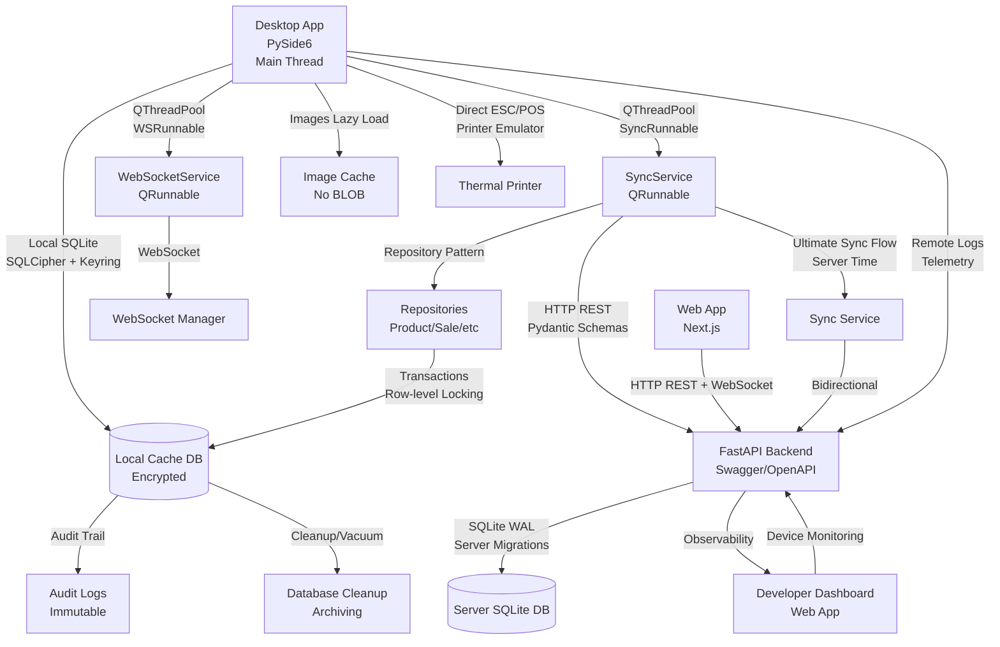

# خطة تحسين Desktop App والربط مع Web App (النسخة النهائية - Production Ready)

## ⚠️ تحذيرات معمارية حرجة

### 1. المشكلة المعمارية الأساسية

**المشكلة الحالية**: التطبيق الحالي يتصل مباشرة بقاعدة البيانات المشتركة (`data/logical_release.db`). هذا خطأ معماري للأسباب التالية:

1. **فساد البيانات**: SQLite غير مصمم لاتصالات شبكية متزامنة بكفاءة عالية
2. **الأمان**: تطبيق العميل لا يجب أن يمتلك وصولاً مباشراً لقاعدة البيانات الرئيسية
3. **القابلية للتوسع**: صعوبة إدارة نسخ متعددة من التطبيق

**الحل**: يجب إعادة هيكلة Desktop App لاستخدام:

- قاعدة بيانات SQLite محلية (Local Cache) على جهاز المستخدم
- الاتصال عبر API فقط (لا اتصال مباشر بقاعدة البيانات الخادم)
- مزامنة ثنائية الاتجاه بين القاعدة المحلية والـ API

### 2. UI Thread Blocking (تأثير الفراشة)

**المشكلة**: إذا قمت بتشغيل عمليات Sync أو WebSocket على Main Thread، ستتجمد الواجهة والحركات (Lags).

**الحل المطلوب**: جميع عمليات SyncService والـ WebSocket يجب أن تُدار داخل Worker Threads باستخدام **QThreadPool** (ليس QThread يدوياً). الواجهة يجب أن تظل 60fps مهما كان حجم البيانات.

---

## المرحلة 0: إعادة هيكلة قاعدة البيانات المحلية (الأولوية القصوى)

### 0.1 إنشاء قاعدة بيانات محلية (Local Cache Database)

**الملفات**:

- `src/core/local_database_manager.py` (جديد)
- `src/core/database_manager.py` (تحديث)

**التنفيذ**:

- إنشاء `LocalDatabaseManager` يدير قاعدة البيانات المحلية
- مسار قاعدة البيانات المحلية: `~/.local/share/logical_erp/local_cache.db` (Linux/Mac) أو `%APPDATA%/LogicalERP/local_cache.db` (Windows)
- **تفعيل WAL Mode**: `PRAGMA journal_mode=WAL` (موجود بالفعل، لكن يجب التأكيد على القاعدة المحلية)
- **ACID Compliance**: ضمان نزاهة البيانات عند انقطاع الكهرباء
- إنشاء جداول مشابهة للجداول الرئيسية في القاعدة المحلية
- إضافة عمود `is_synced` و `last_synced_at` و `sync_version` لكل جدول
- إضافة جدول `sync_queue` لتتبع العمليات المعلقة

### 0.2 تشفير قاعدة البيانات المحلية (SQLCipher + Keyring)

**الملفات**:

- `src/core/local_database_manager.py` (تحديث)
- `src/core/database_encryption.py` (جديد)
- `src/core/keyring_manager.py` (جديد)

**التنفيذ**:

- استخدام **SQLCipher** لتشفير قاعدة البيانات المحلية
- **Keyring Manager**: استخدام Windows Credentials Store / Keyring لتخزين مفاتيح التشفير
  - Windows: `keyring` library → Windows Credential Store
  - Linux: `keyring` → Secret Service API
  - Mac: `keyring` → macOS Keychain
- **لا تخزين المفاتيح كنص واضح**: استخدام Keyring دائماً
- حماية بيانات المبيعات والعملاء من السرقة المحلية

**مثال**:

```python
import keyring
from sqlcipher3 import dbapi2 as sqlite3

# الحصول على المفتاح من Keyring
device_id = get_device_id()
password = keyring.get_password("logical_erp", device_id)

# استخدام SQLCipher
conn = sqlite3.connect(db_path)
conn.execute(f"PRAGMA key='{password}'")
```

### 0.3 تطبيق Soft Delete (حذف منطقي)

**الملفات**:

- `src/core/local_database_manager.py` (تحديث)
- `src/api/routes.py` (تحديث)
- جميع ملفات Services (تحديث)

**التنفيذ**:

- **إزالة Hard Delete تماماً**: لا حذف فعلي من قاعدة البيانات
- إضافة عمود `is_deleted` (INTEGER DEFAULT 0) لجميع الجداول
- إضافة عمود `deleted_at` (TEXT) لجميع الجداول
- عند الحذف: `UPDATE table SET is_deleted = 1, deleted_at = CURRENT_TIMESTAMP`
- في الاستعلامات: `WHERE is_deleted = 0`
- في المزامنة: مزامنة `is_deleted = 1` أيضاً
- تجنب Orphaned Data: حتى السجلات المحذوفة متاحة للمزامنة

### 0.4 نظام Migrations للقاعدة المحلية والخادم

**الملفات**:

- `src/core/local_migrations/__init__.py` (جديد)
- `src/core/local_migrations/migration_manager.py` (جديد)
- `src/api/server_migrations/__init__.py` (جديد)
- `src/api/server_migrations/migration_manager.py` (جديد)
- `src/core/local_migrations/migrations/` (مجلد جديد)
- `src/api/server_migrations/migrations/` (مجلد جديد)

**التنفيذ**:

- إنشاء `LocalMigrationManager` يدير Migrations للقاعدة المحلية
- إنشاء `ServerMigrationManager` يدير Migrations للقاعدة الخادم
- إضافة جدول `schema_migrations` في كلا القاعدتين
- تطبيق Migrations تلقائياً عند بدء التطبيق/الخادم
- **Parameterized Queries فقط**: لا string formatting في Migrations (SQL Injection Protection)
- التحقق من تطابق Schema بين المحلي والخادم

**مثال**:

```python
# ✅ صحيح - Parameterized Query
def upgrade(db):
    db.execute("ALTER TABLE products ADD COLUMN expiry_date TEXT", ())

# ❌ خطأ - String Formatting (SQL Injection)
def upgrade(db):
    db.execute(f"ALTER TABLE {table_name} ADD COLUMN expiry_date TEXT")
```

### 0.5 Repository Pattern (تجنب Logic Scattering)

**الملفات**:

- `src/repositories/__init__.py` (جديد)
- `src/repositories/product_repository.py` (جديد)
- `src/repositories/sale_repository.py` (جديد)
- `src/repositories/base_repository.py` (جديد)
- `src/api/sync_worker.py` (تحديث - استخدام Repository)
- `src/ui/websocket_worker.py` (تحديث - استخدام Repository)

**التنفيذ**:

- إنشاء `BaseRepository` كطبقة وسيطة بين Workers و LocalDatabaseManager
- إنشاء `ProductRepository`, `SaleRepository`, إلخ.
- **لا SQL مباشر في Workers**: جميع الاستعلامات عبر Repository
- **Parameterized Queries فقط**: جميع الاستعلامات parameterized
- **Single Responsibility**: كل Repository يدير جدول واحد فقط

**مثال**:

```python
class BaseRepository:
    def __init__(self, db_manager: LocalDatabaseManager):
        self.db = db_manager
    
    def find_by_id(self, id: int) -> Optional[Dict]:
        return self.db.execute_query(
            "SELECT * FROM table WHERE id = ? AND is_deleted = 0",
            (id,)
        )

class ProductRepository(BaseRepository):
    def find_by_barcode(self, barcode: str) -> Optional[Dict]:
        return self.db.execute_query(
            "SELECT * FROM products WHERE barcode = ? AND is_deleted = 0",
            (barcode,)
        )
```

---

## المرحلة 1: تحسين التصميم والحركات

### 1.1 إضافة نظام الحركات (Qt Animations)

**الملفات**:

- `src/ui/animations/__init__.py` (جديد)
- `src/ui/animations/fade_animation.py` (جديد)
- `src/ui/animations/slide_animation.py` (جديد)
- `src/ui/animations/float_animation.py` (جديد)
- `src/ui/animations/gradient_animation.py` (جديد)

**التنفيذ**:

- استخدام `QPropertyAnimation` و `QParallelAnimationGroup` لإنشاء حركات سلسة
- تطبيق fade-in/fade-out عند فتح/إغلاق النوافذ
- تطبيق slide animations عند التنقل بين الصفحات
- تطبيق float animation للعناصر المهمة (مثل الإشعارات)
- تطبيق gradient animations للأزرار والـ progress bars
- **ضمان 60fps**: جميع الحركات على Main Thread فقط (لا عمليات ثقيلة)

### 1.2 تحسين التأثيرات البصرية

**الملفات**:

- `src/ui/theme_manager.py` (تحديث)
- `src/ui/widgets/gradient_widget.py` (جديد)
- `src/ui/widgets/glass_widget.py` (جديد)

**التنفيذ**:

- إضافة gradient backgrounds للأزرار (cyan إلى purple)
- تحسين glassmorphism effects باستخدام QPainter
- إضافة glow effects للنصوص والأزرار المهمة
- إضافة shadow effects للكروت والجداول

### 1.3 تحديث النوافذ الرئيسية

**الملفات**:

- `src/ui/windows/main_window.py` (تحديث)
- `src/ui/dialogs/login_dialog.py` (تحديث)
- `src/ui/dialogs/product_dialog.py` (تحديث)

**التنفيذ**:

- إضافة حركات fade عند فتح النوافذ
- تطبيق glass panel effects على الـ sidebar
- تحديث الأزرار لتستخدم gradients
- إضافة hover effects محسّنة

---

## المرحلة 2: الربط الحقيقي بين Desktop و Web

### 2.1 QThreadPool بدلاً من QThread (Memory Leaks Prevention)

**الملفات**:

- `src/api/thread_pool_manager.py` (جديد)
- `src/api/sync_worker.py` (تحديث - استخدام QRunnable)
- `src/ui/websocket_worker.py` (تحديث - استخدام QRunnable)
- `src/ui/windows/main_window.py` (تحديث)

**التنفيذ**:

- إنشاء `ThreadPoolManager` يدير QThreadPool موحد
- تحويل `SyncWorker` إلى `SyncRunnable(QRunnable)` بدلاً من `QThread`
- تحويل `WebSocketWorker` إلى `WebSocketRunnable(QRunnable)` بدلاً من `QThread`
- **إعادة استخدام الخيوط**: QThreadPool يعيد استخدام الخيوط (أقل Memory Leaks)
- **ضمان الإغلاق**: cleanup threads عند الإغلاق

**مثال**:

```python
class SyncRunnable(QRunnable):
    def __init__(self, sync_service, callback):
        super().__init__()
        self.sync_service = sync_service
        self.callback = callback
    
    def run(self):
        result = self.sync_service.sync_delta()
        self.callback(result)

# في MainWindow
thread_pool = QThreadPool.globalInstance()
runnable = SyncRunnable(sync_service, on_sync_complete)
thread_pool.start(runnable)
```

### 2.2 Row-level Locking و Transactions (Race Conditions Protection)

**الملفات**:

- `src/core/local_database_manager.py` (تحديث)
- `src/repositories/base_repository.py` (تحديث)
- `src/api/sync_service.py` (تحديث)

**التنفيذ**:

- **Transactions**: جميع عمليات المزامنة داخل Transactions
- **Row-level Locking**: استخدام `SELECT ... FOR UPDATE` في SQLite
- **Lock Timeout**: timeout للانتظار على Lock (تجنب Deadlock)
- **Race Condition Protection**: حماية من التحديثات المتزامنة لنفس السجل

**مثال**:

```python
# في Repository
def update_product(self, product_id: int, data: Dict):
    with self.db.transaction():
        # Lock row
        self.db.execute_query(
            "SELECT * FROM products WHERE id = ? FOR UPDATE",
            (product_id,)
        )
        # Update
        self.db.execute_non_query(
            "UPDATE products SET name = ?, price = ? WHERE id = ?",
            (data['name'], data['price'], product_id)
        )
```

### 2.3 Server Time Sync (تزامن الوقت)

**الملفات**:

- `src/api/api_client.py` (تحديث)
- `src/api/sync_service.py` (تحديث)
- `src/api/routes.py` (تحديث - إضافة endpoint للوقت)

**التنفيذ**:

- إضافة endpoint في API: `GET /api/v1/time` يرسل Server Time
- **استخدام Server Time دائماً**: لتسجيل `last_synced_at`
- **تخزين Time Offset**: الفرق بين Client Time و Server Time
- **تصحيح Client Time**: تطبيق Offset على جميع Timestamps

**مثال**:

```python
# في SyncService
def sync_time(self):
    server_time_response = self.api.get("/api/v1/time")
    server_time = datetime.fromisoformat(server_time_response['time'])
    client_time = datetime.now()
    self.time_offset = server_time - client_time

def get_sync_timestamp(self):
    return (datetime.now() + self.time_offset).isoformat()
```

### 2.4 Circuit Breaker مع Exponential Backoff

**الملفات**:

- `src/api/circuit_breaker.py` (جديد)
- `src/api/sync_service.py` (تحديث)

**التنفيذ**:

- إنشاء `CircuitBreaker` يدير حالات الفشل المتكررة
- **Exponential Backoff**: زيادة وقت الانتظار بين المحاولات (5ث، 10ث، 20ث، 40ث...)
- **Circuit Breaker States**:
  - `CLOSED`: طبيعي (كل الطلبات تمر)
  - `OPEN`: فشل متكرر (توقف المحاولات)
  - `HALF_OPEN`: محاولة استعادة الاتصال
- **وضع الطوارئ (Manual Offline Mode)**: زر يوقف المزامنة تماماً

### 2.5 Ultimate Sync Flow (Local Commit → Handshake → Pull → Conflict Check → Push → Ack)

**الملفات**:

- `src/api/sync_service.py` (تحديث)
- `src/api/routes.py` (تحديث)

**التنفيذ**:

- **Local Commit**: العميل يبيع → تُحفظ في SQLite المحلي (`is_synced=0`)
- **Handshake**: SyncWorker يطلب من API: "هذا آخر timestamp لدي"
- **Pull**: السيرفر يرسل التعديلات الجديدة (Delta Sync)
- **Conflict Check**: التطبيق يقارن (هل يوجد تعارض؟)
- **Push**: التطبيق يرفع العمليات الجديدة (`is_synced=0`)
- **Ack (Acknowledgment)**: السيرفر يؤكد الاستلام → التطبيق يحول الحالة إلى (`is_synced=1`)

**مثال**:

```python
class SyncService:
    def sync_ultimate_flow(self):
        # 1. Local Commit (يحدث تلقائياً عند البيع)
        
        # 2. Handshake
        last_synced = self.local_db.get_last_synced_at()
        handshake = self.api.get(f"/api/v1/sync/handshake?last_synced={last_synced}")
        
        # 3. Pull
        delta_data = self.api.get(f"/api/v1/sync/delta?last_synced={last_synced}")
        for item in delta_data['items']:
            # Conflict Check
            conflict = self.conflict_resolver.check_conflict(item)
            if conflict:
                resolution = self.resolve_conflict(conflict)
                if resolution == 'keep_local':
                    continue
            
            # Apply
            self.local_db.upsert(item)
        
        # 4. Push
        pending_items = self.local_db.get_pending_items()
        push_result = self.api.post("/api/v1/sync/push", pending_items)
        
        # 5. Ack
        for ack_id in push_result['acknowledged_ids']:
            self.local_db.mark_as_synced(ack_id)
        
        # Update last_synced_at with Server Time
        server_time = self.api.get("/api/v1/time")['time']
        self.local_db.set_last_synced_at(server_time)
```

### 2.6 نظام الجلسات المشتركة

**الملفات**:

- `src/services/session_service.py` (جديد)
- `src/api/routes.py` (تحديث)
- `web/lib/auth-context.tsx` (تحديث)

**التنفيذ**:

- إنشاء `SessionService` يدير الجلسات المشتركة
- إضافة endpoint في API للتحقق من الجلسات المشتركة
- تحديث Desktop App للتحقق من الجلسات عند تسجيل الدخول
- إضافة logout من جميع الأجهزة عند تسجيل الخروج
- إضافة session timeout مشترك

### 2.7 تحديثات فورية عبر WebSocket (في Worker Thread)

**الملفات**:

- `src/api/routes.py` (تحديث)
- `src/ui/windows/main_window.py` (تحديث)
- `src/ui/websocket_worker.py` (تحديث)
- `web/lib/websocket-client.ts` (إنشاء/تحديث)

**التنفيذ**:

- إضافة broadcast للتحديثات عند تغيير البيانات في API
- تحديث Desktop App للاستماع للتحديثات وتحديث UI تلقائياً (عبر Signals)
- تحديث Web App للاستماع للتحديثات
- إضافة visual indicators عند استقبال تحديثات

### 2.8 معالجة التعارضات (Conflict Resolution)

**الملفات**:

- `src/api/conflict_resolver.py` (جديد)
- `src/ui/dialogs/conflict_resolution_dialog.py` (جديد)

**التنفيذ**:

- إنشاء `ConflictResolver` يكتشف التعارضات
- إضافة dialog لعرض التعارضات للمستخدم
- إضافة خيارات الحل (Keep Local, Keep Remote, Merge)
- حفظ قرارات المستخدم للتعارضات المستقبلية

---

## المرحلة 3: التكامل والاختبار

### 3.1 إضافة Sync Status Indicator

**الملفات**:

- `src/ui/widgets/sync_status_widget.py` (جديد)
- `src/ui/windows/main_window.py` (تحديث)

**التنفيذ**:

- إنشاء widget يعرض حالة المزامنة
- إضافة indicators للألوان (Connected, Syncing, Error, Offline)
- إضافة tooltip يعرض آخر وقت مزامنة
- إضافة button للمزامنة اليدوية
- إضافة button "وضع أوفلاين" (Manual Offline Mode)

### 3.2 إضافة Notifications للتحديثات

**الملفات**:

- `src/ui/notifications_manager.py` (تحديث)
- `src/ui/windows/main_window.py` (تحديث)

**التنفيذ**:

- إضافة notifications عند استقبال تحديثات من Web
- إضافة notifications عند اكتمال المزامنة
- إضافة notifications عند حدوث تعارضات

### 3.3 تحسين الأداء

**التنفيذ**:

- تحسين batch updates لتقليل عدد الطلبات
- إضافة caching للبيانات المزامنة
- تحسين WebSocket message handling
- إضافة debouncing للمزامنة التلقائية

---

## المرحلة 4: أنظمة الإنتاج الحرجة

### 4.1 نظام التحديث التلقائي (Auto-Updater + App Version Lock)

**الملفات**:

- `src/core/auto_updater.py` (جديد)
- `src/ui/dialogs/update_dialog.py` (جديد)
- `src/api/routes.py` (تحديث - إضافة endpoint للإصدار)

**التنفيذ**:

- إنشاء `AutoUpdater` يتحقق من وجود إصدارات جديدة
- إضافة endpoint في API: `GET /api/v1/version` يرسل آخر إصدار
- **App Version Lock**: رفض الطلبات من إصدارات قديمة جداً (Mandatory Update)
- مقارنة الإصدار الحالي مع الإصدار على الخادم
- عرض dialog عند وجود تحديث جديد
- **Changelog**: عرض قائمة التغييرات في التحديث
- تنزيل وتثبيت التحديث تلقائياً (مع الخيار للمستخدم)
- دعم التحديثات التلقائية واليدوية

**مثال API Response**:

```python
{
    "version": "5.4.0",
    "download_url": "https://example.com/downloads/app-v5.4.0.exe",
    "release_notes": "إصلاحات وتحسينات...",
    "critical": False,
    "min_required_version": "5.2.0",  # App Version Lock
    "changelog": [
        "إصلاح مشكلة المزامنة",
        "تحسين أداء الطباعة",
        "إضافة ميزة جديدة"
    ]
}
```

### 4.2 نظام التسجيل والمراقبة عن بعد (Remote Logging/Telemetry)

**الملفات**:

- `src/core/remote_logger.py` (جديد)
- `src/api/routes.py` (تحديث - إضافة endpoint للـ logs)
- `src/utils/logger.py` (تحديث - إضافة Remote Handler)

**التنفيذ**:

- إنشاء `RemoteLogger` يرسل الأخطاء الحرجة إلى الخادم
- إضافة endpoint في API: `POST /api/v1/logs` لاستقبال الـ logs
- تصنيف الأخطاء (INFO, WARNING, ERROR, CRITICAL)
- إرسال الأخطاء الحرجة (ERROR, CRITICAL) تلقائياً
- إرسال أخطاء المزامنة والاتصال
- إضافة telemetry data (OS, version, sync status)
- دعم إيقاف/تفعيل إرسال الـ logs (privacy)
- **إرسال صامت**: في Worker Thread (لا يعطل UI)

### 4.3 قفل واجهة المستخدم أثناء العمليات الحرجة (UI Blocking Strategy)

**الملفات**:

- `src/ui/widgets/blocking_overlay.py` (جديد)
- `src/ui/windows/main_window.py` (تحديث)
- `src/api/sync_service.py` (تحديث)

**التنفيذ**:

- إنشاء `BlockingOverlay` widget يغطي النافذة الرئيسية
- منع التفاعل مع UI أثناء:
  - المزامنة الأولى (Initial Sync)
  - حل التعارضات
  - تطبيق Migrations
  - التحديثات الحرجة
- عرض Progress Bar مع رسالة توضيحية
- إضافة خيار "Skip" أو "Cancel" للعمليات غير الحرجة
- منع إغلاق النافذة أثناء العمليات الحرجة

### 4.4 Direct Print Service للطابعات الحرارية (ESC/POS + Printer Emulator)

**الملفات**:

- `src/services/direct_print_service.py` (جديد/تحديث)
- `src/services/printer_emulator.py` (جديد)
- `src/services/printing_service.py` (تحديث)
- `src/ui/windows/main_window.py` (تحديث)

**التنفيذ**:

- **لا استخدام حوار Windows**: تجنب `QPrintDialog` (بطيء)
- إنشاء `DirectPrintService` يرسل أوامر ESC/POS مباشرة
- دعم USB و Network printers
- **سرعة الطباعة**: الفاتورة في أقل من ثانية
- **Printer Emulator**: محاكي طابعة لاختبار المخرجات قبل الإرسال
- تحسين الأوامر ESC/POS:
  - `ESC @` (Initialize)
  - `ESC a` (Alignment)
  - `ESC d` (Feed lines)
  - `GS v 0` (Cut paper)
- دعم فتح الدرج النقدي (Cash Drawer)
- معالجة الأخطاء (printer offline, paper out, etc.)

**مثال Printer Emulator**:

```python
class PrinterEmulator:
    def __init__(self):
        self.output = []
    
    def text(self, text: str):
        self.output.append(text)
    
    def cut(self):
        self.output.append("---CUT---")
    
    def get_output(self) -> str:
        return "\n".join(self.output)

# اختبار قبل الطباعة
emulator = PrinterEmulator()
print_service.preview_receipt(emulator, receipt_data)
print(emulator.get_output())  # معاينة قبل الإرسال
```

### 4.5 Lazy Loading للصور والملفات (لا BLOB في قاعدة البيانات)

**الملفات**:

- `src/services/image_service.py` (جديد)
- `src/core/local_database_manager.py` (تحديث)
- `src/api/routes.py` (تحديث - إضافة endpoints للصور)

**التنفيذ**:

- **لا تخزين الصور في قاعدة البيانات**: استبدال BLOB بـ URLs فقط
- تخزين الصور في مجلد `cache/images/` محلياً
- **Lazy Loading**: تحميل الصور عند الحاجة فقط
- **Background Download**: تحميل الصور في الخلفية (Worker Thread)
- **Cache Management**: تنظيف الصور القديمة تلقائياً
- **MIME Type Support**: دعم JPG, PNG, WebP

**مثال**:

```python
# في قاعدة البيانات (لا BLOB)
CREATE TABLE products (
    id INTEGER PRIMARY KEY,
    name TEXT,
    image_url TEXT,  # URL فقط
    ...
);

# في ImageService
class ImageService:
    def get_image(self, url: str) -> QPixmap:
        # تحميل من Cache أو Download
        local_path = self.cache_path / hashlib.md5(url.encode()).hexdigest()
        if not local_path.exists():
            self.download_image(url, local_path)
        return QPixmap(str(local_path))
```

### 4.6 نظام Audit Trail (التدقيق المالي)

**الملفات**:

- `src/core/audit_trail.py` (جديد)
- `src/core/local_database_manager.py` (تحديث)
- `src/api/routes.py` (تحديث - إضافة endpoint للـ audit logs)

**التنفيذ**:

- إنشاء جدول `audit_logs` يسجل كل التغييرات
- **لا حذف أبداً**: جدول audit_logs لا يتم حذفه أبداً
- **تسجيل كل التغييرات**: CREATE, UPDATE, DELETE (حتى Soft Delete)
- **تسجيل القيم القديمة والجديدة**: `old_value`, `new_value`
- **تسجيل المستخدم والوقت**: `user_id`, `timestamp`, `action`
- **Endpoint للتحليل**: `GET /api/v1/audit-logs` للتحليل المالي

**مثال**:

```python
CREATE TABLE audit_logs (
    id INTEGER PRIMARY KEY,
    table_name TEXT,
    record_id INTEGER,
    action TEXT,  -- 'create', 'update', 'delete'
    old_value TEXT,  -- JSON
    new_value TEXT,  -- JSON
    user_id INTEGER,
    timestamp TEXT,
    device_id TEXT
);

# في Repository
def update(self, id: int, data: Dict):
    old_value = self.find_by_id(id)
    self.db.update(...)
    new_value = self.find_by_id(id)
    self.audit_trail.log('update', 'products', id, old_value, new_value)
```

### 4.7 Database Cleanup / Vacuum (تنظيف البيانات القديمة)

**الملفات**:

- `src/core/database_cleanup.py` (جديد)
- `src/core/local_database_manager.py` (تحديث)

**التنفيذ**:

- **Archiving Strategy**: أرشفة البيانات القديمة (مبيعات ما قبل 3 سنوات)
- **Vacuum**: `VACUUM` دوري لتحسين الأداء
- **Cleanup Schedule**: تنظيف تلقائي شهرياً
- **Retention Policy**: حفظ البيانات الحرجة دائماً (audit_logs)

**مثال**:

```python
class DatabaseCleanup:
    def archive_old_sales(self, years: int = 3):
        cutoff_date = datetime.now() - timedelta(days=years * 365)
        # نقل إلى جدول archived_sales
        self.db.execute(
            "INSERT INTO archived_sales SELECT * FROM sales WHERE created_at < ?",
            (cutoff_date,)
        )
        self.db.execute(
            "DELETE FROM sales WHERE created_at < ?",
            (cutoff_date,)
        )
        # Vacuum
        self.db.execute("VACUUM")
```

---

## المرحلة 5: Code Quality & Production Readiness

### 5.1 Pydantic Data Contracts (API Contracts)

**الملفات**:

- `src/api/schemas/__init__.py` (جديد)
- `src/api/schemas/product.py` (جديد)
- `src/api/schemas/sale.py` (جديد)
- `src/api/routes.py` (تحديث - استخدام Schemas)

**التنفيذ**:

- استخدام **Pydantic** لتوثيق Data Contracts في FastAPI
- إنشاء Schemas لجميع Models (Product, Sale, Customer, إلخ)
- **Validation**: التحقق من صحة البيانات تلقائياً
- **Type Safety**: ضمان عدم حدوث خطأ عند تغيير هيكل البيانات
- **Documentation**: Schemas تظهر تلقائياً في Swagger

**مثال**:

```python
from pydantic import BaseModel, Field
from datetime import datetime
from typing import Optional

class ProductSchema(BaseModel):
    id: Optional[int] = None
    name: str = Field(..., min_length=1, max_length=255)
    barcode: Optional[str] = None
    price: float = Field(..., gt=0)
    is_deleted: int = Field(default=0, ge=0, le=1)
    created_at: Optional[datetime] = None
    updated_at: Optional[datetime] = None
    
    class Config:
        json_schema_extra = {
            "example": {
                "name": "منتج تجريبي",
                "barcode": "123456789",
                "price": 100.0
            }
        }

# في API
@router.post("/api/v1/products", response_model=ProductSchema)
async def create_product(product: ProductSchema):
    # FastAPI يتحقق تلقائياً من صحة البيانات
    ...
```

### 5.2 Swagger/OpenAPI Documentation

**الملفات**:

- `src/api/app.py` (تحديث)

**التنفيذ**:

- تفعيل Swagger/OpenAPI تلقائياً في FastAPI
- **Documentation URL**: `/docs` (Swagger UI)
- **Alternative URL**: `/redoc` (ReDoc)
- **API Schema**: `/openapi.json`
- **Tags & Descriptions**: توثيق جميع endpoints

**مثال**:

```python
from fastapi import FastAPI
from fastapi.openapi.docs import get_swagger_ui_html

app = FastAPI(
    title="Logical ERP API",
    description="API documentation for Logical ERP system",
    version="5.4.0",
    docs_url="/docs",
    redoc_url="/redoc",
    openapi_url="/openapi.json"
)
```

### 5.3 Developer Dashboard (Observability)

**الملفات**:

- `web/app/admin/dashboard/page.tsx` (جديد)
- `src/api/routes.py` (تحديث - إضافة endpoints للمراقبة)
- `web/components/admin/device-monitor.tsx` (جديد)

**التنفيذ**:

- إنشاء لوحة تحكم في Web App لعرض حالة جميع Desktop Apps
- **Device List**: قائمة بجميع الأجهزة المتصلة
- **Device Info**: إصدار كل جهاز، آخر وقت مزامنة، حالة الاتصال
- **Metrics**: نسبة استهلاك الذاكرة، عدد الفواتير اليومية، آخر خطأ
- **Remote Actions**: إمكانية إرسال أوامر للأجهزة (Sync Now, Restart, Update)

**مثال API Endpoints**:

```python
@router.get("/api/v1/admin/devices")
async def get_devices():
    # قائمة بجميع الأجهزة
    return [
        {
            "device_id": "abc123",
            "device_name": "POS-01",
            "version": "5.4.0",
            "last_sync": "2024-01-01T10:00:00",
            "status": "online",
            "memory_usage": 45.2,
            "today_sales": 150
        }
    ]

@router.post("/api/v1/admin/devices/{device_id}/sync")
async def trigger_sync(device_id: str):
    # إرسال أمر Sync للأجهزة
    ...
```

### 5.4 Stress Testing (اختبار الضغط)

**الملفات**:

- `tests/stress_test.py` (جديد)
- `scripts/generate_test_data.py` (جديد)

**التنفيذ**:

- إنشاء سكربت يولد 10,000 فاتورة وهمية في القاعدة المحلية
- **Network Throttling**: محاكاة اتصال 3G (بطيء)
- **Responsiveness Test**: التحقق من أن UI يظل مستجيباً (60fps)
- **Data Integrity Test**: التحقق من عدم ضياع أي فاتورة
- **Performance Metrics**: قياس الوقت والأداء

**مثال**:

```python
def stress_test():
    # توليد 10,000 فاتورة
    for i in range(10000):
        sale_data = generate_fake_sale()
        db.insert_sale(sale_data)
    
    # محاكاة اتصال 3G (بطيء)
    with network_throttle(3G_SPEED):
        sync_service.sync_all()
    
    # التحقق
    assert db.count_synced_sales() == 10000
    assert ui_responsiveness() > 50  # FPS
```

### 5.5 PyInstaller Build (توزيع التطبيق)

**الملفات**:

- `build.spec` (جديد)
- `scripts/build.py` (جديد)
- `requirements-build.txt` (جديد)

**التنفيذ**:

- إعداد PyInstaller مع `--onefile`
- **ضغط الموارد**: تقليل حجم .exe
- **Icons & Resources**: إضافة الأيقونات والموارد
- **Hidden Imports**: تحديد جميع المكتبات المطلوبة
- **UPX Compression**: استخدام UPX لضغط أكبر

**مثال build.spec**:

```python
# -*- mode: python ; coding: utf-8 -*-

a = Analysis(
    ['main.py'],
    pathex=[],
    binaries=[],
    datas=[
        ('assets', 'assets'),
        ('config', 'config'),
    ],
    hiddenimports=[
        'PySide6',
        'sqlcipher3',
        'keyring',
    ],
    hookspath=[],
    hooksconfig={},
    runtime_hooks=[],
    excludes=[],
    noarchive=False,
    optimize=2,
)

pyz = PYZ(a.pure, a.zipped_data, cipher=block_cipher)

exe = EXE(
    pyz,
    a.scripts,
    a.binaries,
    a.zipfiles,
    a.datas,
    [],
    name='LogicalERP',
    debug=False,
    bootloader_ignore_signals=False,
    strip=False,
    upx=True,  # ضغط UPX
    upx_exclude=[],
    runtime_tmpdir=None,
    console=False,  # لا console window
    icon='assets/icons/app_icon.ico',
    onefile=True,
)
```

---

## الملفات الرئيسية للتعديل (النسخة النهائية)

### ملفات جديدة (50+ ملف):

**المرحلة 0 (إعادة الهيكلة)**:

1. `src/core/local_database_manager.py`
2. `src/core/database_encryption.py`
3. `src/core/keyring_manager.py`
4. `src/core/local_migrations/__init__.py`
5. `src/core/local_migrations/migration_manager.py`
6. `src/api/server_migrations/__init__.py`
7. `src/api/server_migrations/migration_manager.py`
8. `src/core/local_migrations/migrations/001_initial_schema.py`
9. `src/core/local_migrations/migrations/002_add_sync_columns.py`
10. `src/core/local_migrations/migrations/003_add_soft_delete.py`
11. `src/repositories/__init__.py`
12. `src/repositories/base_repository.py`
13. `src/repositories/product_repository.py`
14. `src/repositories/sale_repository.py`

**المرحلة 1-2 (التصميم والربط)**:

15-30. (ملفات الحركات والـ Workers والـ Sync...)

**المرحلة 4 (الإنتاج)**:

31. `src/services/image_service.py`
32. `src/core/audit_trail.py`
33. `src/core/database_cleanup.py`
34. `src/services/printer_emulator.py`

**المرحلة 5 (Code Quality)**:

35. `src/api/schemas/__init__.py`
36. `src/api/schemas/product.py`
37. `src/api/schemas/sale.py`
38. `web/app/admin/dashboard/page.tsx`
39. `web/components/admin/device-monitor.tsx`
40. `tests/stress_test.py`
41. `scripts/generate_test_data.py`
42. `build.spec`
43. `scripts/build.py`

---

## المخطط المعماري النهائي (Production Ready)



---

## الأولويات النهائية (Production Ready)

### أولوية قصوى (Critical - Must Have):

1. **المرحلة 0.1-0.5**: Local Cache + SQLCipher + Keyring + Soft Delete + Repository Pattern + Migrations
2. **المرحلة 2.1-2.2**: QThreadPool + Row-level Locking (Memory Leaks + Race Conditions)
3. **المرحلة 2.3-2.5**: Server Time Sync + Circuit Breaker + Ultimate Sync Flow
4. **المرحلة 4.5-4.6**: Images Lazy Loading + Audit Trail (لا BLOB + تدقيق مالي)

### أولوية عالية (High - Should Have):

5. **المرحلة 4.1**: Auto-Updater + App Version Lock + Changelog
6. **المرحلة 4.4**: Direct Print Service + Printer Emulator (Critical for POS)
7. **المرحلة 4.7**: Database Cleanup (Performance)
8. **المرحلة 5.1-5.2**: Pydantic Contracts + Swagger (API Documentation)

### أولوية متوسطة (Medium - Nice to Have):

9. **المرحلة 5.3**: Developer Dashboard (Observability)
10. **المرحلة 5.4**: Stress Testing (Quality Assurance)
11. **المرحلة 5.5**: PyInstaller Build (Distribution)

---

## المعايير الناجحة النهائية (Production Ready Checklist)

### Code Quality ✅:

1. ✅ Repository Pattern مطبق (لا SQL مباشر في Workers)
2. ✅ Pydantic Data Contracts في FastAPI
3. ✅ Parameterized Queries فقط (SQL Injection Protection)
4. ✅ Unit Tests للـ Conflict Resolver والـ Sync Service

### Performance ✅:

5. ✅ QThreadPool بدلاً من QThread (Memory Leaks Prevention)
6. ✅ Database Cleanup/Vacuum (تجنب تضخم القاعدة)
7. ✅ Images Lazy Loading (لا BLOB في قاعدة البيانات)
8. ✅ Stress Test نجح (10,000 فاتورة + 3G = Responsive)

### Security ✅:

9. ✅ SQLCipher + Keyring (تشفير آمن للمفاتيح)
10. ✅ Row-level Locking + Transactions (Race Conditions Protection)
11. ✅ Server Time Sync (تزامن الوقت)
12. ✅ Audit Trail (التدقيق المالي)

### Reliability ✅:

13. ✅ Ultimate Sync Flow (Local Commit → Handshake → Pull → Conflict Check → Push → Ack)
14. ✅ Circuit Breaker + Exponential Backoff + Manual Offline Mode
15. ✅ App Version Lock (Mandatory Updates)
16. ✅ Remote Logging + Developer Dashboard (Observability)

### User Experience ✅:

17. ✅ Direct Print Service + Printer Emulator (سرعة الطباعة)
18. ✅ UI Thread Safety (60fps دائماً)
19. ✅ UI Blocking Strategy (منع التفاعل أثناء العمليات الحرجة)
20. ✅ Auto-Updater + Changelog

---

## المرحلة 6: مراجعة الجودة والتحقق الدقيق (Quality Review & Verification)

### 6.1 عملية المراجعة الدقيقة لكل مهمة

**الهدف**: ضمان جودة الكود وعدم وجود أخطاء قبل اعتبار أي مهمة مكتملة.

**الملفات**:

- `docs/REVIEW_CHECKLIST.md` (جديد)
- `scripts/code_review.py` (جديد)

**التنفيذ**:

#### أ. معايير المراجعة العامة (لكل مهمة):

1. **مراجعة الكود (Code Review)**:

   - ✅ لا توجد أخطاء syntax أو runtime errors
   - ✅ جميع الاستعلامات parameterized (لا string formatting)
   - ✅ معالجة الأخطاء موجودة (try/except)
   - ✅ لا توجد hardcoded values (استخدام config/constants)
   - ✅ التعليقات واضحة ومفيدة
   - ✅ أسماء المتغيرات والدوال واضحة ووصفية

2. **مراجعة الأمان (Security Review)**:

   - ✅ لا SQL Injection (Parameterized Queries فقط)
   - ✅ لا تخزين مفاتيح/كلمات مرور كنص واضح
   - ✅ التحقق من صلاحيات المستخدم عند الحاجة
   - ✅ معالجة البيانات الحساسة بشكل آمن

3. **مراجعة الأداء (Performance Review)**:

   - ✅ لا عمليات ثقيلة على Main Thread (UI Thread)
   - ✅ استخدام QThreadPool/QRunnable للعمليات الخلفية
   - ✅ لا Memory Leaks (إغلاق الموارد بشكل صحيح)
   - ✅ استخدام Transactions للعمليات المتعددة

4. **مراجعة التكامل (Integration Review)**:

   - ✅ التكامل مع الأنظمة الأخرى يعمل
   - ✅ لا تعارضات مع الكود الموجود
   - ✅ Backward Compatibility محفوظة (إن أمكن)

5. **مراجعة الاختبار (Testing Review)**:

   - ✅ الكود يعمل في بيئة التطوير
   - ✅ لا أخطاء عند التشغيل
   - ✅ الاختبارات اليدوية تمت (إن وجدت)
   - ✅ Edge Cases تم التعامل معها

#### ب. معايير المراجعة الخاصة بكل نوع من المهام:

**للمهام المتعلقة بقاعدة البيانات**:

- ✅ WAL Mode مفعل
- ✅ Transactions مستخدمة بشكل صحيح
- ✅ Soft Delete مطبق (لا Hard Delete)
- ✅ Row-level Locking مستخدم عند الحاجة
- ✅ Parameterized Queries فقط

**للمهام المتعلقة بالـ API**:

- ✅ Pydantic Schemas مستخدمة
- ✅ Error Handling موجود
- ✅ Response Format متسق
- ✅ Authentication/Authorization محقق

**للمهام المتعلقة بالـ UI**:

- ✅ UI Thread Safety (لا عمليات ثقيلة على Main Thread)
- ✅ Animations سلسة (60fps)
- ✅ Error Messages واضحة للمستخدم
- ✅ Loading States موجودة

**للمهام المتعلقة بالمزامنة**:

- ✅ Ultimate Sync Flow مطبق
- ✅ Conflict Resolution يعمل
- ✅ Server Time مستخدم
- ✅ Circuit Breaker يعمل

#### ج. Checklist المراجعة لكل مهمة:

**قبل اعتبار المهمة مكتملة، يجب التحقق من**:

```
□ الكود يعمل بدون أخطاء
□ جميع الاستعلامات parameterized
□ معالجة الأخطاء موجودة
□ لا Memory Leaks
□ UI Thread Safety محقق (إن كانت المهمة تتعلق بـ UI)
□ الاختبارات اليدوية تمت
□ التكامل مع الأنظمة الأخرى يعمل
□ لا تعارضات مع الكود الموجود
□ التعليقات واضحة
□ الأسماء واضحة ووصفية
□ Security Review تم
□ Performance Review تم
□ Integration Review تم
```

#### د. عملية المراجعة:

1. **بعد إكمال كل مهمة**:

   - مراجعة الكود يدوياً
   - تشغيل الكود والتحقق من عمله
   - التحقق من Checklist المراجعة
   - إصلاح أي مشاكل مكتشفة

2. **قبل الانتقال للمهمة التالية**:

   - التأكد من أن جميع معايير المراجعة محققة
   - تسجيل أي ملاحظات أو تحسينات مقترحة
   - تحديث حالة المهمة إلى "مكتمل" فقط بعد المراجعة

3. **للمهام الحرجة**:

   - مراجعة إضافية من مطور آخر (إن أمكن)
   - اختبارات إضافية
   - توثيق التغييرات

### 6.2 أداة مراجعة الكود التلقائية

**الملفات**:

- `scripts/code_review.py` (جديد)
- `.github/workflows/code-review.yml` (جديد - اختياري)

**التنفيذ**:

- إنشاء سكربت يفحص الكود تلقائياً:
  - البحث عن SQL Injection vulnerabilities
  - البحث عن Hard Delete statements
  - البحث عن عمليات ثقيلة على Main Thread
  - البحث عن Memory Leaks محتملة
  - التحقق من Parameterized Queries

**مثال**:

```python
def review_code(file_path: str) -> List[str]:
    issues = []
    
    with open(file_path, 'r', encoding='utf-8') as f:
        content = f.read()
    
    # Check for SQL Injection
    if re.search(r'f".*SELECT.*\{', content):
        issues.append("Potential SQL Injection: String formatting in SQL")
    
    # Check for Hard Delete
    if re.search(r'DELETE FROM', content, re.IGNORECASE):
        issues.append("Hard Delete detected: Should use Soft Delete")
    
    # Check for Main Thread blocking
    if 'QThread' not in content and 'requests.get' in content:
        issues.append("Potential UI blocking: API call without QThread")
    
    return issues
```

### 6.3 سجل المراجعة (Review Log)

**الملفات**:

- `docs/REVIEW_LOG.md` (جديد)

**التنفيذ**:

- تسجيل كل مراجعة مع:
  - اسم المهمة
  - تاريخ المراجعة
  - الملفات المراجعة
  - المشاكل المكتشفة
  - الإصلاحات المطبقة
  - حالة المراجعة (✅ مكتمل / ⚠️ يحتاج إصلاح)

**مثال**:

```markdown
## Review Log

### 2024-01-15 - Local Database Manager
**المهمة**: local-database-refactor
**الملفات**: `src/core/local_database_manager.py`
**المشاكل المكتشفة**:
- ✅ لا توجد مشاكل
**الإصلاحات**: لا يوجد
**الحالة**: ✅ مكتمل
```

### 6.4 معايير القبول (Acceptance Criteria)

**لكل مهمة، يجب أن تحقق**:

1. **الوظيفية (Functionality)**:

   - ✅ الميزة تعمل كما هو متوقع
   - ✅ جميع الحالات (Edge Cases) تم التعامل معها
   - ✅ لا أخطاء عند الاستخدام العادي

2. **الجودة (Quality)**:

   - ✅ الكود نظيف ومنظم
   - ✅ لا توجد Code Smells
   - ✅ يتبع Best Practices

3. **الأمان (Security)**:

   - ✅ لا ثغرات أمنية معروفة
   - ✅ البيانات الحساسة محمية
   - ✅ Authentication/Authorization محقق

4. **الأداء (Performance)**:

   - ✅ لا Memory Leaks
   - ✅ UI Responsive (60fps)
   - ✅ لا عمليات ثقيلة على Main Thread

5. **التكامل (Integration)**:

   - ✅ يعمل مع الأنظمة الأخرى
   - ✅ لا تعارضات
   - ✅ Backward Compatibility محفوظة

### 6.5 عملية المراجعة الخطوة بخطوة

**للمطور** (بعد إكمال كل مهمة):

1. **مراجعة ذاتية (Self Review)**:
   ```
   □ قراءة الكود المكتوب
   □ التحقق من Checklist المراجعة
   □ تشغيل الكود والتحقق من عمله
   □ إصلاح أي مشاكل واضحة
   ```

2. **اختبار يدوي (Manual Testing)**:
   ```
   □ تشغيل التطبيق
   □ اختبار الميزة الجديدة
   □ اختبار Edge Cases
   □ اختبار Integration مع الأنظمة الأخرى
   ```

3. **مراجعة الكود (Code Review)**:
   ```
   □ التحقق من Security
   □ التحقق من Performance
   □ التحقق من Code Quality
   □ التحقق من Documentation
   ```

4. **التوثيق (Documentation)**:
   ```
   □ تحديث REVIEW_LOG.md
   □ تسجيل أي ملاحظات
   □ تحديث حالة المهمة
   ```

5. **الموافقة النهائية (Final Approval)**:
   ```
   □ جميع معايير القبول محققة
   □ لا مشاكل معلقة
   □ المهمة جاهزة للانتقال للمرحلة التالية
   ```


---

## الخلاصة النهائية

المشروع الآن أصبح **نظام ERP هجين Production Ready** يغطي:

✅ **الناحية التقنية**: Workers, Circuit Breaker, Repository Pattern, Pydantic, Thread Safety

✅ **الناحية التشغيلية**: Auto-Updater, Direct Print, Database Cleanup, Stress Testing

✅ **الناحية الأمنية**: SQLCipher, Keyring, Audit Trail, Row-level Locking

✅ **الناحية التوثيقية**: Swagger, Pydantic Schemas, Developer Dashboard

**الخطوة التالية**: بدء التنفيذ من المرحلة 0 (الأولوية القصوى)

---

## ⚠️ شرط المراجعة الدقيقة (Mandatory Review Process)

### قاعدة ذهبية: لا مهمة تعتبر مكتملة بدون مراجعة دقيقة

**قبل اعتبار أي مهمة (Todo) مكتملة، يجب**:

1. ✅ **مراجعة الكود**: قراءة الكود المكتوب والتحقق من جودته
2. ✅ **اختبار يدوي**: تشغيل الكود والتحقق من عمله
3. ✅ **التحقق من Checklist**: التأكد من تحقيق جميع معايير المراجعة
4. ✅ **إصلاح المشاكل**: معالجة أي مشاكل مكتشفة قبل الانتقال
5. ✅ **التوثيق**: تسجيل المراجعة في REVIEW_LOG.md

### معايير المراجعة السريعة (Quick Review Checklist):

**لكل مهمة، تحقق من**:

- [ ] الكود يعمل بدون أخطاء
- [ ] جميع الاستعلامات parameterized (لا SQL Injection)
- [ ] معالجة الأخطاء موجودة
- [ ] لا Memory Leaks (إغلاق الموارد)
- [ ] UI Thread Safety (إن كانت المهمة تتعلق بـ UI)
- [ ] Security Review تم
- [ ] Performance Review تم
- [ ] Integration Review تم
- [ ] الاختبارات اليدوية تمت
- [ ] لا تعارضات مع الكود الموجود

### عملية المراجعة الإلزامية:

```
1. إكمال المهمة
   ↓
2. مراجعة الكود (Self Review)
   ↓
3. اختبار يدوي (Manual Testing)
   ↓
4. التحقق من Checklist
   ↓
5. إصلاح المشاكل (إن وجدت)
   ↓
6. توثيق المراجعة
   ↓
7. ✅ المهمة مكتملة
```

**⚠️ تحذير**: لا تنتقل للمهمة التالية حتى تكمل المراجعة الدقيقة للمهمة الحالية.