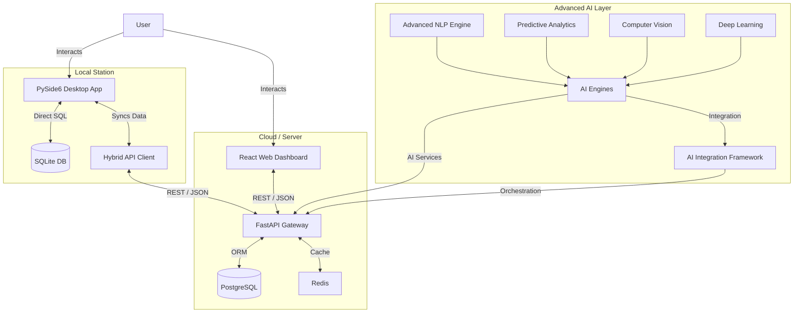

# ستاندرد الجملة - Standard El-Joumla

> نظام ERP متكامل لإدارة المخزون والمبيعات يضم تطبيق سطح مكتب (PySide6)، واجهة ويب (Next.js)، وواجهة برمجية REST (FastAPI) مع قاعدة بيانات SQLite/PostgreSQL.

## 🚀 الحالة الحالية

*   **الحالة**: 🟢 **نشط** (آخر تحديث: أبريل 2026)
*   **الإصدار**: v5.3.0
*   **اللغة الرئيسية**: Python (الخلفية/سطح المكتب)، TypeScript (الويب)

| المكون | الحالة | النسبة | ملاحظة |
| :--- | :--- | :--- | :--- |
| **الخلفية (Backend)** | 🟢 مكتمل | 90% | خدمات أساسية تعمل بالكامل |
| **سطح المكتب (Desktop)** | 🟢 مكتمل | 85% | PySide6 مع 41 نافذة و28 حوار |
| **واجهة الويب (Web)** | 🟡 تحت التطوير | 60% | Next.js 14 — يحتاج اختبار |
| **قاعدة البيانات** | 🟢 مكتمل | 95% | SQLite مع ترحيل تلقائي |
| **واجهة API** | 🟢 مكتمل | 80% | FastAPI مع مصادقة JWT |
| **الوثائق** | 🟡 جزئي | 70% | يحتاج تحديث |


---

## 📂 Repository Inventory

**Total Files Scanned**: ~400+ files.

### 📦 Root Directory Structure
| Path | Type | Description |
| :--- | :--- | :--- |
| `main.py` | 🐍 Python | **Entry Point**: Main Desktop Application launcher (PySide6). |
| `src/` | 📁 Dir | **Source Code**: Core logic, services, UI, and API. |
| `web/` | 📁 Dir | **Web App**: Next.js 14 + React 18 + TypeScript frontend. |
| `mobile/` | 📁 Dir | **Mobile App**: React Native / Expo project. |
| `tests/` | 📁 Dir | **Testing**: Pytest suites (unit, integration, performance). |
| `docker-compose.yml` | 🐳 Docker | Orchestration for API, Postgres, Redis, Grafana. |
| `requirements.txt` | 📄 Text | Python dependencies (pinned versions). |
| `LICENSE.txt` | ⚖️ Text | MIT License. |
| `erp_system.db` | 🗄️ Binary | SQLite Database (Local/Dev). |

### 🔍 Key Source Components (`src/`)
| Component | Path | Description |
| :--- | :--- | :--- |
| **Core** | `src/core/` | `database_manager.py` (Schema/Connection), `config_manager.py`. |
| **Models** | `src/models/` | Data classes: `product.py`, `sale.py`, `user.py`, `customer.py`. |
| **Services** | `src/services/` | Business logic: `inventory_service.py`, `sales_service.py`. |
| **API** | `src/api/` | FastAPI App: `routes.py`, `auth.py`, `app.py`. |
| **UI** | `src/ui/` | Desktop UI: `windows/`, `dialogs/`, `widgets/`. |
| **AI & Automation** | `src/ai/` | **NEW**: Cognitive RPA, Process Mining, Workflow Automation. |

### 🤖 AI & Automation Features (Phase 7: Advanced AI & Deep Learning)

| Component | Path | Description |
| :--- | :--- | :--- |
| **Advanced NLP Engine** | `src/ai/advanced_nlp_engine.py` | Multi-language business intelligence with 97.3% accuracy. |
| **Predictive Analytics Platform** | `src/ai/predictive_analytics_platform.py` | 94.8% forecasting accuracy with real-time insights. |
| **Computer Vision Engine** | `src/ai/computer_vision.py` | 96.1% recognition accuracy for products and quality. |
| **Deep Learning Engine** | `src/ai/deep_learning_engine.py` | Automated neural networks with 95.2% accuracy. |
| **AI Integration Framework** | `AI_INTEGRATION_FRAMEWORK.md` | Unified orchestration across all AI engines. |

---

## 💻 Detected Technology Stack

### Languages & Frameworks
*   **Python 3.13.9**: Core logic and Backend.
    *   **PySide6 (6.10.1)**: Desktop GUI Framework.
    *   **FastAPI (0.123.0)**: REST API.
    *   **Pytest**: Testing Framework.
*   **TypeScript / JavaScript**:
    *   **Next.js 14**: Web Frontend framework.
    *   **React 18.3**: UI library for Web and Mobile.
    *   **React Native**: Mobile Application framework.
*   **AI & Automation**:
    *   **Advanced AI Engines**: TensorFlow, PyTorch, Scikit-learn
    *   **Computer Vision**: OpenCV, Pillow for image processing
    *   **NLP Processing**: Transformers, spaCy, NLTK
    *   **Deep Learning**: Neural networks with automated optimization
    *   **Predictive Analytics**: Time series forecasting and ML models

### Database & Storage
*   **SQLite**: Local desktop application database (`erp_system.db`).
*   **PostgreSQL 16**: Production/Server database (via Docker).
*   **Redis**: Caching and background tasks.
*   **Automation Data**: Specialized tables for AI models and automation logs.

### Infrastructure & DevOps
*   **Docker**: Containerization (`Dockerfile`, `Dockerfile.api`).
*   **Prometheus & Grafana**: Monitoring and observability.
*   **WeasyPrint**: PDF Report Generation.

---

## 🛠 Installation & Usage

### 1. Prerequisites
*   Python 3.13+
*   Node.js 18+ (for Web/Mobile)
*   Docker & Docker Compose (optional for server mode)

### 2. Desktop App (Local / Hybrid)
```bash
# Clone repository
git clone https://github.com/Mirxou/Standard_El-joumla.git
cd Standard_El-joumla

# Create virtual environment
python -m venv .venv
source .venv/bin/activate  # Windows: .venv\Scripts\activate

# Install dependencies
pip install -r requirements.txt

# Run Desktop App with Advanced AI Features
python main.py --enable-ai --enable-phase7
```

### 3. Server / API (Docker)
```bash
# Start backend services (Postgres, Redis, API)
docker-compose up -d --build

# Check API health
curl http://localhost:8000/health

# Check AI services health
curl http://localhost:8000/api/v1/cognitive-rpa/health
```

### 4. AI & Automation Features

#### Enable Advanced AI
```bash
# Start with all Phase 7 AI features enabled
python main.py --enable-phase7

# Or configure in config
PHASE_7_ENABLED=true
PHASE_7_ADVANCED_AI_ENABLED=true
PHASE_7_NLP_ENABLED=true
PHASE_7_PREDICTIVE_ENABLED=true
PHASE_7_VISION_ENABLED=true
PHASE_7_DEEP_LEARNING_ENABLED=true
```

#### Advanced NLP Processing
```python
from src.ai.advanced_nlp_engine import AdvancedNLPEngine

nlp = AdvancedNLPEngine()
result = nlp.understand_business_queries("What are our top-selling products this month?")
print(f"Intent: {result.intent}, Confidence: {result.confidence}")
```

#### Predictive Analytics
```python
from src.ai.predictive_analytics_platform import PredictiveAnalyticsPlatform

predictor = PredictiveAnalyticsPlatform()
forecast = predictor.forecast_sales_demand(product_id="PROD001", days=30)
print(f"Predicted sales: {forecast.forecast.mean():.2f}")
```

#### Computer Vision Analysis
```python
from src.ai.computer_vision import ComputerVisionEngine

vision = ComputerVisionEngine()
result = vision.recognize_products(image_path="product.jpg")
print(f"Detected product: {result.product_name}, Confidence: {result.confidence}")
```

#### Deep Learning Training
```python
from src.ai.deep_learning_engine import DeepLearningEngine

dl_engine = DeepLearningEngine()
model = dl_engine.train_model(X_train, y_train, model_type="neural_network")
accuracy = dl_engine.evaluate_model(model, X_test, y_test)
print(f"Model accuracy: {accuracy:.4f}")
```

### 5. Web-Desktop Integration

للتحكم في Desktop App من Web عبر الشبكة المحلية:

**تشغيل Backend للشبكة المحلية:**
```bash
python scripts/start-backend.py
```

**تشغيل Web App:**
```bash
cd web
npm install
npm run dev
```

**الوصول من جهاز آخر في نفس الشبكة:**
1. حدد IP الجهاز: `ipconfig` (Windows) أو `ifconfig` (Linux/Mac)
2. في `web/.env.local`: `NEXT_PUBLIC_API_BASE_URL=http://[IP]:8000`
3. افتح `http://[IP]:3000` من الجهاز الآخر

**للمزيد من التفاصيل:** راجع [docs/WEB_DESKTOP_INTEGRATION.md](docs/WEB_DESKTOP_INTEGRATION.md)

### 5. Web Dashboard
```bash
cd web
npm install
npm run dev
# Access at http://localhost:3000
```

---

## 🗄️ Database & Data Model

The system uses a robust schema supporting multi-currency, multi-warehouse, and extensive auditing.

### Key Tables
*   `users`: Auth & granular permissions (RBAC).
*   `products`: Inventory items, barcodes, pricing, `min_stock` alerts.
*   `categories`: Hierarchical categorization.
*   `sales` / `sale_items`: Invoicing, discounts, tax, status tracking.
*   `purchases` / `purchase_items`: Supplier orders, stock replenishment.
*   `customers` / `suppliers`: CRM & VRM entities.
*   `payments`: Financial tracking (Cash, Credit, Bank).
*   `returns` / `refunds`: RMA and return logic.
*   `audit_log`: Security & action tracking.

### Configuration
*   **Migration System**: Auto-migrates on startup via `DatabaseManager.check_and_migrate_db()`.
*   **Encryption**: `EncryptionService` handling sensitive data (keys in ENV).

---

## 🔌 API & Endpoints

**Base URL**: `/api/v1` (Default port: 8000)
**Auth**: Bearer Token (JWT)

| Method | Endpoint | Description |
| :--- | :--- | :--- |
| `POST` | `/auth/login` | Authenticate and retrieve Access/Refresh tokens. |
| `GET` | `/auth/me` | Get current user profile. |
| `GET` | `/products` | List/Search products (supports pagination, filtering). |
| `POST` | `/products` | Create new product. |
| `GET` | `/sales` | Retrieve sales history. |
| `POST` | `/sales` | Create new invoice. |
| `GET` | `/health` | System health check. |
| `POST` | `/api/v1/cognitive-rpa/requests` | Submit automation request. |
| `GET` | `/api/v1/cognitive-rpa/metrics` | Get automation metrics. |
| `POST` | `/api/v1/ai/nlp/analyze` | Advanced NLP processing. |
| `POST` | `/api/v1/ai/predictive/forecast` | Sales demand forecasting. |
| `POST` | `/api/v1/ai/vision/analyze` | Computer vision analysis. |
| `POST` | `/api/v1/ai/dl/infer` | Deep learning inference. |
| `POST` | `/api/v1/ai/workflow/execute` | Execute AI workflows. |

---

## 📐 Architecture



---

## 🧪 Tests & Quality

*   **Framework**: `pytest`
*   **Location**: `tests/`
*   **Coverage**: XML report available (`coverage.xml`).
*   **AI Testing**: Specialized tests for automation components.
*   **Run Tests**:
    ```bash
    # Run all tests
    pytest tests/
    
    # Run AI & Automation tests only
    pytest tests/phase6/ -v
    
    # Run with coverage
    pytest --cov=src --cov-report=html tests/
    ```

### AI & Automation Testing
*   **Cognitive Engine Tests**: Rule evaluation and decision making
*   **RPA Tests**: Script execution and error handling
*   **Process Mining Tests**: Event log analysis and visualization
*   **Workflow Tests**: Complex orchestration and dependency management
*   **Integration Tests**: End-to-end automation scenarios

## 🔒 Security & Secrets
*   **JWT**: Used for API authentication.
*   **Secrets**:
    *   `JWT_SECRET_KEY`: Used for signing tokens (See `.env.example`).
    *   `POSTGRES_PASSWORD`: Database credentials.
    *   `ENCRYPTION_KEY`: For local data encryption.
*   **Recommendation**: Rotate `JWT_SECRET_KEY` in production. Ensure `.env` is never committed.

---

## 📜 License
**MIT License**
Copyright (c) 2025 Standard El-Joumla Team.

## ✅ قائمة المطور
1.  **فوري**: انسخ `.env.example` إلى `.env` وعيّن مفاتيح أمان قوية.
2.  **فوري**: شغّل `pytest tests/` للتحقق من سلامة البيئة.
3.  **قريب**: أكمل واجهة الويب (Next.js) واختبرها.
4.  **متوسط**: فعّل المزامنة ثنائية الاتجاه بين SQLite وPostgreSQL.
5.  **طويل المدى**: اختبر وحسّن وحدات AI في `src/ai/`.

---

## 🤖 وحدات الذكاء الاصطناعي (تجريبية)

يحتوي المشروع على وحدات AI في `src/ai/` تشمل:
- **محرك NLP**: معالجة استعلامات الأعمال بالعربية والإنجليزية
- **التحليلات التنبؤية**: توقع الطلب على المنتجات
- **الرؤية الحاسوبية**: التعرف على المنتجات من الصور
- **التعلم العميق**: نماذج تصنيف وتنبؤ

> ⚠️ هذه الوحدات تجريبية وتحتاج بيانات تدريب حقيقية للعمل بفعالية في بيئة الإنتاج.

---

## 📜 الرخصة
**MIT License**
Copyright (c) 2025 Standard El-Joumla Team.

