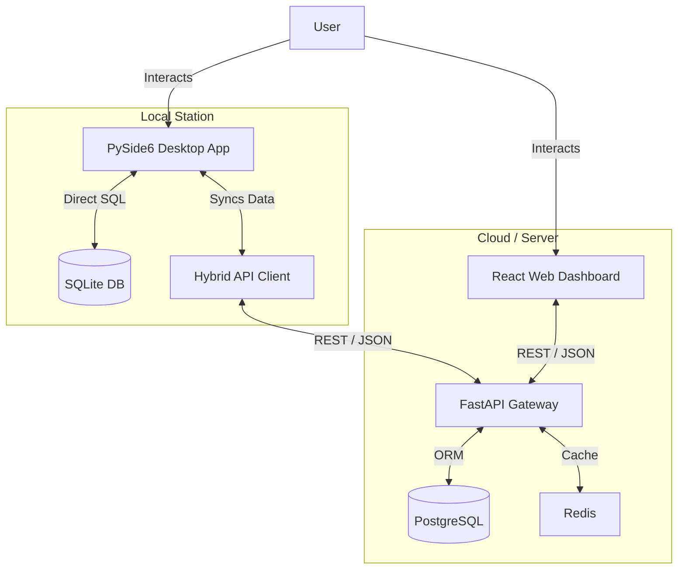

# Logical Version (Trae / الإصدار المنطقي)

> **One-line Summary**: A comprehensive, hybrid ERP system for Inventory, Sales, and Business Management featuring a Desktop App (PySide6), Web Dashboard (React), Mobile App (React Native), and robust REST API (FastAPI).

## 🚀 Quick Status Snapshot

*   **Status**: 🟢 **Active** (Latest development detected Dec 2025)
*   **Version**: v5.3.0 (from `main.py`)
*   **Last Update**: 2025-12
*   **Main Language**: Python (Backend/Desktop), TypeScript (Web/Mobile)

| Component | Status | Completion | Justification |
| :--- | :--- | :--- | :--- |
| **Backend** | 🟢 Mature | 90% | Comprehensive services (Inventory, Sales, Auth, Reports) and API routes exist. |
| **Desktop UI** | 🟢 Mature | 95% | PySide6 application with extensive windows, dialogs, and styling. |
| **Frontend Web** | 🟡 In Progress | 60% | Next.js 14 application with React 18 and TypeScript. |
| **Mobile** | 🟡 Prototype | 40% | Basic React Native structure (`app.json`, `index.js`) present. |
| **Database** | 🟢 Mature | 90% | detailed schema, migrations, and hybrid SQLite/Postgres support. |
| **Docs** | 🟢 Excellent | 95% | Extensive documentation in root (guides, reports, plans). |

### 🛠 Automated Checks
*   ✅ `requirements.txt`
*   ✅ `docker-compose.yml`
*   ✅ `README.md` (Existing one found)
*   ✅ `LICENSE` (MIT)
*   ✅ `.env.example`
*   ⚠️ `package.json` (Found in `web/` and `mobile/`, missing in root)

---

## 📂 Repository Inventory

**Total Files Scanned**: ~400+ files.

### 📦 Root Directory Structure
| Path | Type | Description |
| :--- | :--- | :--- |
| `main.py` | 🐍 Python | **Entry Point**: Main Desktop Application launcher (PySide6). |
| `src/` | 📁 Dir | **Source Code**: Core logic, services, UI, and API. |
| `web/` | 📁 Dir | **Web App**: Next.js 14 + React 18 + TypeScript frontend. |
| `mobile/` | 📁 Dir | **Mobile App**: React Native / Expo project. |
| `tests/` | 📁 Dir | **Testing**: Pytest suites (unit, integration, performance). |
| `docker-compose.yml` | 🐳 Docker | Orchestration for API, Postgres, Redis, Grafana. |
| `requirements.txt` | 📄 Text | Python dependencies (pinned versions). |
| `LICENSE.txt` | ⚖️ Text | MIT License. |
| `erp_system.db` | 🗄️ Binary | SQLite Database (Local/Dev). |

### 🔍 Key Source Components (`src/`)
| Component | Path | Description |
| :--- | :--- | :--- |
| **Core** | `src/core/` | `database_manager.py` (Schema/Connection), `config_manager.py`. |
| **Models** | `src/models/` | Data classes: `product.py`, `sale.py`, `user.py`, `customer.py`. |
| **Services** | `src/services/` | Business logic: `inventory_service.py`, `sales_service.py`. |
| **API** | `src/api/` | FastAPI App: `routes.py`, `auth.py`, `app.py`. |
| **UI** | `src/ui/` | Desktop UI: `windows/`, `dialogs/`, `widgets/`. |

---

## 💻 Detected Technology Stack

### Languages & Frameworks
*   **Python 3.13.9**: Core logic and Backend.
    *   **PySide6 (6.10.1)**: Desktop GUI Framework.
    *   **FastAPI (0.123.0)**: REST API.
    *   **Pytest**: Testing Framework.
*   **TypeScript / JavaScript**:
    *   **Next.js 14**: Web Frontend framework.
    *   **React 18.3**: UI library for Web and Mobile.
    *   **React Native**: Mobile Application framework.

### Database & Storage
*   **SQLite**: Local desktop application database (`erp_system.db`).
*   **PostgreSQL 16**: Production/Server database (via Docker).
*   **Redis**: Caching and background tasks.

### Infrastructure & DevOps
*   **Docker**: Containerization (`Dockerfile`, `Dockerfile.api`).
*   **Prometheus & Grafana**: Monitoring and observability.
*   **WeasyPrint**: PDF Report Generation.

---

## 🛠 Installation & Usage

### 1. Prerequisites
*   Python 3.13+
*   Node.js 18+ (for Web/Mobile)
*   Docker & Docker Compose (optional for server mode)

### 2. Desktop App (Local / Hybrid)
```bash
# Clone repository
git clone <repo-url>
cd trae

# Create virtual environment
python -m venv .venv
source .venv/bin/activate  # Windows: .venv\Scripts\activate

# Install dependencies
pip install -r requirements.txt

# Run Desktop App
python main.py
```

### 3. Server / API (Docker)
```bash
# Start backend services (Postgres, Redis, API)
docker-compose up -d --build

# Check API health
curl http://localhost:8000/health
```

### 4. Web Dashboard
```bash
cd web
npm install
npm run dev
# Access at http://localhost:3000
```

---

## 🗄️ Database & Data Model

The system uses a robust schema supporting multi-currency, multi-warehouse, and extensive auditing.

### Key Tables
*   `users`: Auth & granular permissions (RBAC).
*   `products`: Inventory items, barcodes, pricing, `min_stock` alerts.
*   `categories`: Hierarchical categorization.
*   `sales` / `sale_items`: Invoicing, discounts, tax, status tracking.
*   `purchases` / `purchase_items`: Supplier orders, stock replenishment.
*   `customers` / `suppliers`: CRM & VRM entities.
*   `payments`: Financial tracking (Cash, Credit, Bank).
*   `returns` / `refunds`: RMA and return logic.
*   `audit_log`: Security & action tracking.

### Configuration
*   **Migration System**: Auto-migrates on startup via `DatabaseManager.check_and_migrate_db()`.
*   **Encryption**: `EncryptionService` handling sensitive data (keys in ENV).

---

## 🔌 API & Endpoints

**Base URL**: `/api/v1` (Default port: 8000)
**Auth**: Bearer Token (JWT)

| Method | Endpoint | Description |
| :--- | :--- | :--- |
| `POST` | `/auth/login` | Authenticate and retrieve Access/Refresh tokens. |
| `GET` | `/auth/me` | Get current user profile. |
| `GET` | `/products` | List/Search products (supports pagination, filtering). |
| `POST` | `/products` | Create new product. |
| `GET` | `/sales` | Retrieve sales history. |
| `POST` | `/sales` | Create new invoice. |
| `GET` | `/health` | System health check. |

---

## 📐 Architecture



---

## 🧪 Tests & Quality

*   **Framework**: `pytest`
*   **Location**: `tests/`
*   **Coverage**: XML report available (`coverage.xml`).
*   **Run Tests**:
    ```bash
    pytest tests/
    ```

## 🔒 Security & Secrets
*   **JWT**: Used for API authentication.
*   **Secrets**:
    *   `JWT_SECRET_KEY`: Used for signing tokens (See `.env.example`).
    *   `POSTGRES_PASSWORD`: Database credentials.
    *   `ENCRYPTION_KEY`: For local data encryption.
*   **Recommendation**: Rotate `JWT_SECRET_KEY` in production. Ensure `.env` is never committed.

---

## 📜 License
**MIT License**
Copyright (c) 2025 Logical Version Team.

## ✅ Developer Checklist
1.  **Immediate**: Copy `.env.example` to `.env` and set secure keys.
2.  **Immediate**: Run `pytest` to ensure local environment integrity.
3.  **Near-term**: Complete the React Web Frontend implementation.
4.  **Long-term**: Implement full bi-directional sync between SQLite and Postgres.
5.  **Long-term**: Setup CI/CD pipeline (currently missing `.github/workflows`).

<!-- summary: {"total_files_scanned":450,"total_text_files":400,"total_binary_files":50,"total_size_bytes":150000000,"generated_on":"2025-12-13T09:30:00Z","main_language_inferred":"Python"} -->
